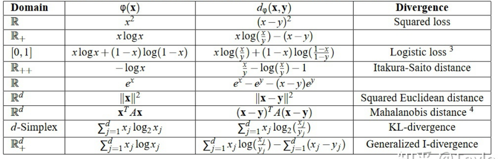

# 机器学习中的散度
+ 最近看论文，发现很多文章中常常使用不同的散度来度量两个分布之间的距离，因此在这里对它们进行一个纳的归。

## KL散度
+ **定义**
$$
D_{\text{KL}}(p\|q) = -\int p(x)\log\frac{q(x)}{p(x)}\mathrm{d}x
$$
+ $D_{\text{KL}}(p\|q)\geq 0$，当且仅当$p=q$时取等。这一性质可使用Jensen不等式进行证明
  $$D_{\text{KL}}(p\|q)=-\int p(x)\log\frac{q(x)}{p(x)}\mathrm{d}x\geq -\log\int q(x)\mathrm{d}x=0 $$
+ 不对称。即
  $$D_{\text{KL}}(p\|q)\not = D_{\text{KL}}(q\|p)$$

## 对称散度
### JS散度
+ **定义**
$$D_{\text{JS}}(p\|q)=\frac 12 D_{\text{KL}}(p\| \frac {p+q}2)+\frac 12 D_{\text{KL}}(q\|\frac{p+q}2)$$

### $\alpha$-散度
+ **定义**
$$D_{\alpha}(p\|q) = \frac {4}{1-\alpha^2}\left(1-\int p(x)^{\frac {1+\alpha}2}q(x)^{\frac{1-\alpha}2}\mathrm{d}x\right)$$
+ **性质**
  + 非负。对于所有的$\alpha$，$\alpha$散度均非负。
  + $\alpha\to -1$对应于$D_{\text{KL}}(q\|p)$，$\alpha\to 1$对应于$D_{\text{KL}}(p\|q)$。
  + $\alpha=0$时，得到一个对称散度，和**Hellinger**距离线性相关。
  + $\alpha\leq -1$时，散度是**zero forcing**的，即对于$p(x)=0$的值，有$q(x)=0$，此时得到的$q$会低估$p$的support；$\alpha\geq 1$时，散度是**zero avoiding**的，即对于$p(x)>0$的值，有$q(x)>0$，此时得到的$q$会高估$p$的support。

## $f$-散度
+ **定义**
  + 令$f$为一凸函数满足：$f$是一个凸函数，$f(1)=0$.
  + $f$-散度定义为
  $$D_f(p\|q)=\int q(x)f(\frac{p(x)}{q(x)})\mathrm{d}x $$
+ 使用$f$-散度可以对应到很多其他的散度定义
  + KL散度: $\int p(x)\log \frac{p(x)}{q(x)}\mathrm{d}x $
    + $f=u\log u$
  + 逆KL散度: $\int q(x)\log\frac{q(x)}{p(x)}\mathrm{d}x $
    + $f=-\log u$
  + Total Variance散度: $\frac{1}{2} \int|p(x)-q(x)| d x$
    + $f=\frac 12|u-1|$
  + $Pearson-\chi^2$散度: $\int \frac{(p(x)-q(x))^2}{q(x)}\mathrm{d}x $
    + $f=\frac{(1-u)^2}u$
  + $Neyman-\chi^2$散度: $\int \frac{(q(x)-p(x))^2}{q(x)}\mathrm{d}x $
    + $f=(u-1)^2$
  + Jeffrey距离: $\int (p(x)-q(x))\log(\frac{p(x)}{q(x)})\mathrm{d}x $
    + $f=(u-1)\log u$
+ **性质**
  + $f$的性质保证上述散度均非负，可使用$f$为凸函数的性质和$f(1)=0$推出。
  + 如果进一步有$f$为严格凸函数，则会有正定性，即$D_f(P\|Q)=0\leftrightarrow P=Q$。

## Bregman散度
+ **定义**
  Bregman散度是另一大类散度的通用表征形式。若在欧氏空间中我们定义范数模长为$\varphi(\cdot)$，同时定义内积$\langle \cdot,\cdot\rangle$，于是可以进一步定义由该函数生成的距离
  $$
  \begin{aligned}
      d(x,y)&= \varphi(x)-(\varphi(y)+\langle \nabla \varphi(y), x-y\rangle)\\
  \end{aligned}
  $$
  以下给出了一些凸函数$\varphi(\cdot)$和由$\varphi$导出的Bregman散度定义。
  
+ 当上面的数据点$ \boldsymbol{x},\boldsymbol{y} $是一个分布时，Bregman散度导出的就是分布之间的距离。

## Wasserstein距离
+ **Motivation**: 对于KL散度和JS散度，如果两个分布的距离很远，完全没有重叠，那么KL散度的距离是完全没有意义的，而JS散度是一个常数。（比如在某个点处$p(x)$很大，而$q(x)\to0$，则$\log \frac {q(x)}{p(x)}\to -\infty$）。
+ **定义**
$$
\begin{aligned}
W_p(\mu, \nu) &= \left(\inf_{\gamma\in \Pi(\mu, \nu)}\mathbb{E}_{(x,y)\sim \gamma}[\|x-y\|^p]\right)^{1/p}\\
&=\left(\inf_{\gamma\in\Pi(\mu, \nu)}\int_{\mathcal{X}\times \mathcal{X}}\|x-y\|^p \mathrm{d}\gamma(x, y)\right)^{1/p}
\end{aligned}
$$
  其中$\Pi(\mu, \nu)$为由$\mu$和$\nu$组合形成的所有可能的联合分布。优化目标的直观含义是在$\gamma$这种“路径规划”（指定要把给定的$x$移动到哪个$y$）下，把概率分布$\mu$移动成$\nu$的期望消耗。
  在一维情况下，Wasserstein距离的定义为
  $$
  W_p(\mu, \nu) =\|F_\mu^{-1}-F_\nu^{-1}\|_p=\left(\int_0^1|F_\mu^{-1}(\alpha)-F_\nu^{-1}(\alpha)|^p \mathrm{d}\alpha\right)^{1/p}
  $$
  其中$F_\mu, F_\nu$分别是分布$\mu, \nu$的累积分布函数。

