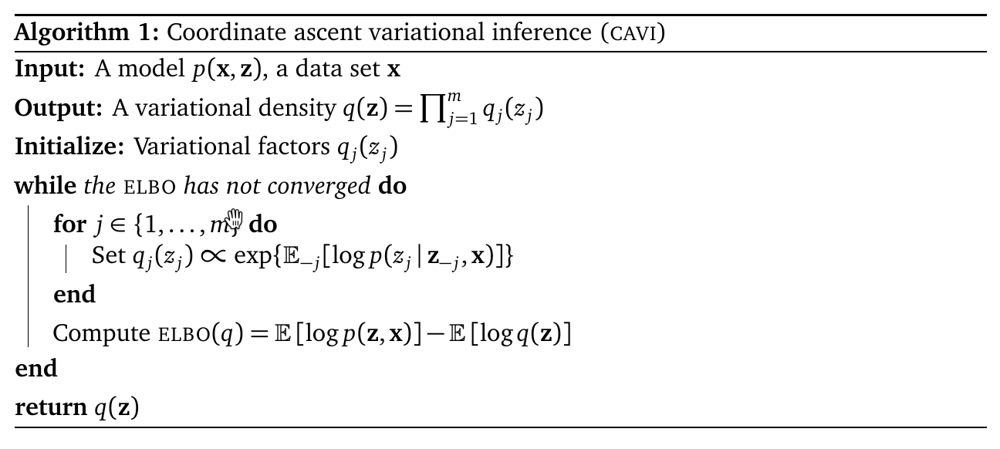

# 变分推断
+ 在概率方法中，对参数/隐变量的推断问题都可以看作是对后验概率的推断，而后验概率需要指数级的时间才能精确计算。
+ MCMC是一种近似计算后验概率的方法，但是MCMC多次仿真的速度很慢，往往也只能近似单峰的分布，因此可以将后验概率的计算转化为优化问题，使用变分推断的想法对隐变量进行推断。
+ 变分推断提出一族关于隐变量的近似概率分布$ \mathcal{Q} $，然后从这一族分布中找到一个能够最小化与真实分布的KL Divergence的分布
  $$q^*(\boldsymbol{z})=\argmin_{q\in \mathcal{Q}} KL(q(\boldsymbol{z})\|p(\boldsymbol{z}|\boldsymbol{x}))$$
  因此，变分推断的关键在于寻找到足够flexible的分布簇，使得它们能够很好的表示后验分布$p(\boldsymbol{z}|\boldsymbol{x})$，但同时也不能太复杂，因为我们需要对它们进行优化

## 细节
+ 由于对散度的优化
    $$q^*(\boldsymbol{z})=\argmin_{q\in \mathcal{Q}} KL(q(\boldsymbol{z})\|p(\boldsymbol{z}|\boldsymbol{x}))$$
  中仍然存在边际分布$p(x)$的计算，我们考虑将其孤立出来
  $$\operatorname{KL}(q(\mathbf{z}) \| p(\mathbf{z} \mid \mathbf{x}))=\mathbb{E}[\log q(\mathbf{z})]-\mathbb{E}[\log p(\mathbf{z}, \mathbf{x})]+\log p(\mathbf{x})$$
  其中所有的期望都是相对于$q(\mathbf{x})$而言的。由于$p(\mathrm{x})$不可计算，转而优化另一项：Evidence Lower Bound
  $$\operatorname{ELBO}(q)=\mathbb{E}[\log p(\mathbf{z}, \mathbf{x})]-\mathbb{E}[\log q(\mathbf{z})]$$
  显然ELBO是$q(\mathrm{z})$与$p(\mathrm{z}|\mathrm{x})$的负KL散度加上$\log p(\mathrm{x})$。同时，$p(\mathrm{x})$与$q(\mathrm{z})$无关。因此，选择合适的$q(\mathrm{z})$最大化ELBO等同于最小化KL散度。
+ ELBO的形式也对应我们解决问题时的两个目标
  $$\begin{aligned}
\operatorname{ELBO}(q) &=\mathbb{E}[\log p(\mathbf{z})]+\mathbb{E}[\log p(\mathbf{x} \mid \mathbf{z})]-\mathbb{E}[\log q(\mathbf{z})] \\
&=\mathbb{E}[\log p(\mathbf{x} \mid \mathbf{z})]-\operatorname{KL}(q(\mathbf{z}) \| p(\mathbf{z}))
\end{aligned}$$
  + 一方面，第一项要求用于估计的概率分布能使得证据变量出现的后验概率尽可能大，提高可解释性
  + 另一方面，希望$q(\mathrm{z})$能够尽量靠近$ \mathrm{z} $的先验。
+ ELBO同时也是我们的优化目标$\log p(\mathbf{x})$的下界
  $$\log p(\mathbf{x})=\operatorname{KL}(q(\mathbf{z}) \| p(\mathbf{z} \mid \mathbf{x}))+\operatorname{ELBO}(q)$$
  + 某种程度上这也使得ELBO成为评估log-likelihood的选择模型的一个指标

## The Mean-field Variational Family
+ 该函数组假设隐变量各分量相互独立，各自由不同的variational factor $q_j$决定
  $$q(\mathbf{z})=\prod_{j=1}^m q_j(z_j)$$
+ 对于每个分量各自的variational factor，它们可以是不同的分布，例如Gaussian/Categorical等
+ 我们也可以进一步复杂化上述模型，比如添加分量之间的关联，以及为variational family添加隐变量等，但则会导致计算速度上的trade-off
+ Mean-field Variational Family的缺点
  + **无法处理隐变量之间的相关性**。当隐变量之间的相关性不为0，即是一个斜着的Gaussian时，平均场永远只能用一个长短轴均在坐标轴上的椭圆来近似。
  + **过低估计$p(\mathbf{z}|\mathbf{x})$的support**。这其实是由于KL散度本身不对称的缺陷：$q(\cdot)$相对于$p(\mathbf{z}|\mathbf{x})$的KL散度总是倾向惩罚$q$较大，而$p$较小的位置，反之则不然。从而会作出相对保守的估计，在$p$较小的位置处将$q$置零。

## Coordinate Ascent Mean-field Variational Inference
+ 上面已经给出了在Mean-field Variational Family下变分推断问题的形式，下面我们使用Coordinate Ascent方法对问题进行求解。具体而言，在每个时间步，我们只考虑 隐变量中的一个分量$z_j$，并使与它对应的variational factor更新为
  $$q_{j}^{*}\left(z_{j}\right) \propto \exp \left\{\mathbb{E}_{-j}\left[\log p\left(z_{j} \mid \mathbf{z}_{-j}, \mathbf{x}\right)\right]\right\}$$
  由于$ \mathbf{z}_{-j},\mathbf{x} $与$z_j$无关，因此上述优化目标正比于
  $$q_{j}^{*}\left(z_{j}\right) \propto \exp \left\{\mathbb{E}_{-j}\left[\log p\left(z_{j}, \mathbf{z}_{-j}, \mathbf{x}\right)\right]\right\}$$
+ 总体算法如下
  
+ **Derivation**
  + 我们首先将ELBO写成$ z_j $的函数
  $$\operatorname{ELBO}\left(q_{j}\right)=\mathbb{E}_{j}\left[\mathbb{E}_{-j}\left[\log p\left(z_{j}, \mathbf{z}_{-j}, \mathbf{x}\right)\right]\right]-\mathbb{E}_{j}\left[\log q_{j}\left(z_{j}\right)\right]+\text { const }$$
  除了一个常数因子以外，$q_j$与$q_j^*$之间的负KL散度就是ELBO
  $$
  \begin{aligned}
    \operatorname{KL}(q_j\|q_j^*)&=\mathbb{E}_j[\log q_j-\log q_j^*]\\
    &=\mathbb{E}_j[\log q_j-\log \alpha-\mathbb{E}_{-j}[\log p(z_j, \mathbf{z}_{-j}, \mathbf{x})]]\\
    &=-\mathbb{E}_j[\mathbb{E}_{-j}[\log p(z_j \mathbf{z}_{-j}, \mathbf{x})]]+\mathbb{E}_j[\log q_j]-\log \alpha\\
    &=-\operatorname{ELBO}(q_j)+\text{const}
  \end{aligned}
  $$
  某种程度上类似Gibbs Sampling，固定所有其他隐变量和证据变量，使用当前优化变量的期望（的平方）。
  