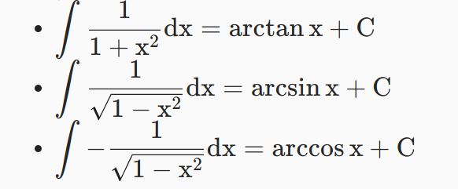
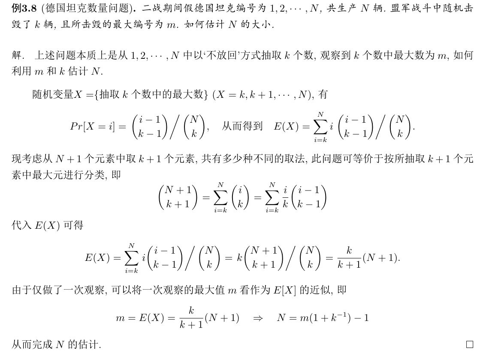

# 数学分析
+ 确界的定义
  
+ bernoulli不等式
  
+ 几个实数连续性定理
  + 单调有界
  + 确界定理（有界数集必有确界）
  + 收敛子列 Weierstrass定理
  + 闭区间套定理
+ 中值定理
  + 罗尔定理：函数在闭区间$[a,b]$上连续，在$(a,b)$可导...
  + Lagrange中值定理
  + 柯西中值定理
  
+ Talor展式
+ 积分公式
  

---

# 高等代数
+ 代数学基本定理
  + 如何消除重因式？$\frac {f(x)}{(f(x), f'(x))}$
+ 余子式和代数余子式

---
# 概率论
+ 组合计数
  
+ 概率论入门部分
  + 独立性，互斥性和不相关的定义
+ 离散型随机变量
  + 德国坦克数量的估计问题
  
  + 几何分布：在bernoulli分布中，重复实验直到出现正面朝上为止
  + 泊松分布 $p(X=k)=\frac {e^{-\lambda}}{k!}\lambda^k$，均值方差为$\lambda, \lambda^2$
+ 连续型高斯变量
  +  指数分布$\lambda e^{-\lambda x}$，均值方差分别为$\frac 1\lambda,\frac 1 \lambda^2$
  +  指数分布的分布函数是$1-e^{-\lambda x}$
+ 高斯分布的特性
  + 边缘分布仍然是高斯分布
  + 变量不相关等价于独立
+ 多元概率分布
  + 最大最小分布
  + 和分布——卷积公式
  + 期望的Cauchy-Schwartz不等式
  $$ \mathbb{E}[XY]^2\leq \mathbb{E}[X^2]\mathbb{E}[Y^2] $$
+ 协方差
  + $Cov(X,Y) = E[XY]-E[X]E[Y]\leq Var(X)Var(Y)$
  + 马尔科夫不等式 切比雪夫不等式
+ 大数定律
  + 如果随机变量序列满足一定条件，那么随着n的增大，这些随机变量的均值依概率收敛于它们各自期望的均值
    + $\frac{\frac 1n Var(\sum _{i}X_i)}\to 0$
    + $Var(X_i)\leq c$
+ 中心极限定理
  + 对于iid随机变量序列，有$\frac 1n \sum_{i=1}^n X_i = N(\mu, \frac {\sigma^2}{n})$

---
# 离散数学
+ 关系的性质：自反性，反自反，对称，反对称，传递性
  + 计算传递闭包，有点类似Floyd-Warshall算法
+ 等价关系：自反、对称、传递的关系叫做等价关系
  + 等价类
+ 偏序关系
  + 偏序关系：自反 反对称和传递的关系
+ 图论
  + 简单图、多重图
  + 握手定理
  + 图的连通性
    + 连通图：任意两点都连通的无向图称作连通图
  + 欧拉图
    + 欧拉图（包含图中所有边的回路）当且仅当图中所有点的连通度均为偶数
      + 若G为欧拉图，则图中无桥
    + 半欧拉图（包含图中所有边的路径）当且仅当图中有且仅有两个点的连通度为奇数
    + 哈密顿图：经过图中所有顶点的初级回路
    + 半哈密顿图：经过图中所有顶点的初级通路

---
# 数据结构与算法
+ BST 二叉搜索树
  + 插入节点略
  + 查找节点
  + 查找后继节点（分右侧是否为null讨论）
  + 删除节点
    + 没有子节点/有一个子节点，ez
    + 有两个子节点，先交换右子树的后继节点，交换然后提升子树
+ Treap
  + 插入节点，按照BST性质进行插入，使用左右旋转修复堆性质
  + 删除元素
    + 使用旋转将元素旋转到叶节点，然后删除
+ 图
  + 无向图的连通分量：直接run一次DFSALL即可
  + 有向图的强联通分量：首先计算reverse graph，计算结束时间，按照结束时间倒序依次DFS，每次DFS出来的就是一个SCC。原理是Sink SCC中进行DFS得到的一定是Sink SCC中的所有点
+ 最小生成树问题
  + Kruskal算法：按照边权升序，每次找到能使当前CC数减一的边加入边集中
  + Prim算法：从一个CC开始，维护一个距离当前CC最近的点加入边集中
+ 最短路问题
  + SSSP：
    + **无负边**：Dijkstra, $O((m+n)\log n)$
    + 可能有负环：Bellman-Ford, $O(mn)$
      + 可以改进，在Bellman-Ford中大量的松弛操作 是无效的，可以先进行一次DAG，然后按照DAG的顺序对点进行松弛。但是前提是，这个方法只能用于DAG，而Dijkstra没有负环就可以了
  + ASAP算法
    + Floyd-Warshall算法
    + 定义$V_r$
    + (u,v,r)->(u,v,r+1)，每次只需要关注多出来的唯一的$x_r$即可
    + 时间复杂度为$O(n^3)$

---
# 凸优化
+ 凸函数判定
  + 零阶条件略
  + 一阶条件：$\forall y, f(y)\geq f(x)+\nabla f(x)(y-x)$
  + 二阶条件：$\nabla^2 f(x)\succcurlyeq 0$
+ 凸优化问题的最优性条件
  + 一阶条件：$\nabla f(x)^T(y-x)\geq 0, \forall y\in dom f$
+ 向量优化
  + Pareto最优
+ 拉格朗日对偶
  + Slater条件：存在一点，对于仿射不等式不需要严格成立，而对于非仿射的不等式约束需要严格成立
+ 无约束情况下的优化方法
  + 梯度下降法
  + 最速下降法（与梯度下降法的不同之处在于使用的范数不同）
  + 牛顿法：$\Delta_{nt} x = \nabla^2 f(x)^{-1}\nabla f(x)$
+ 强凸性
  + 存在$m$，使$\nabla^2 f(x)\geq mI$

---
# 高级机器学习
+ 支持向量机
  + 对偶形式使用SMO算法进行求解，每次选取一对变量
+ 贝叶斯分类器
  + 贝叶斯最优分类器是所有分类器所能做到的最好表现，指的是在所有概率都已知的前提下，总是选择在给定$ \boldsymbol{x} $的情况下使条件风险最小的标记
+ 集成学习
  + 两种基本方法：Boosting/Bagging
  + 集成方法
    + 平均法，学习法，投票法
  + 多样性增强
    + 数据样本、输入属性、输出表示、算法参数扰动等等
+ 聚类
  + 距离度量属性
    + 连续属性：距离度量，Minkovski距离
    + 离散属性：VDM
  + 聚类方法
    + 高斯混合聚类
    + 学习向量量化
    + K-Means
+ 特征选择方法
  + 包裹式过滤式嵌入式（L1正则化）
  + 常常使用PGD进行求解

---
# new和malloc的区别

---
# 排序算法的比较
+ 冒泡排序
  + 最优$O(n)$，最坏$O(n^2)$
  + 稳定
+ 选择排序
  + 几乎总是$O(n^2)$，每次都要针对当前的元素进行轮询
  + 不稳定
+ 插入排序
  + 最优$O(n)$，最差$O(n^2)$
  + 稳定
+ 归并排序
  + $O(n\log n)$
  + 但是需要$O(n)$的空间
  + 稳定
+ 快速排序
  + $O(n\log n)$
  + 不稳定

---
Good afternoon, professors, thank you all for this interview. My name is Gaochenxiao, and I come from School of Artificial Intelligence in Nanjing University. 

I would like to describe myself as an open-minded and thoughtful person. During the past three years in Nanjing University, I took a lot of courses and laid a solid foundation of mathematics, computer science. In the final evaluation of the first five semesters, i ranked 5 among my peers, and was therefore awarded several scholarships like chou-tai-fook scholarship. 

In terms of competitions, I participated in MCM, which is an abbreviation for Mathematical contest in Modelling, and our team was awarded as meritorious winner at last. I was also a technical consultant for a team which participated in the College Student Entrepreneurship Competition. Recently our team entered the final round of the competition and is highly expected to win an award.  It's also worth mentioning that since the first semester of my junior,year, I have joined lamda-5 as an intern, and the main focus of my research was Reinforcement Learning especially Meta Reinforcement Learning. In this period of internship, I grasped the core knowledge about RL, exercised my programming skills and prepared myself for future research.

And today, I'm here, hoping to pursue for a further education in Nanjing University. I plan to concentrate on the field of RL in my graduate time. If I can get accepted, I will keep on broadening and sharpening my professional skills with all the resources and guidance I can obtain here and try to make a contribution to this field. 

And that's all for my self introduction, thank you. 

---
各位老师下午好，我是高辰潇，来自南京大学人工智能学院。
在人工智能学院学习的三年里，我接受了系统的关于人工智能的基础教育，并且打下了坚实的数学和编程基础。在前五学期的评估中，我在学院排名第五，也因此获得了包括周大福奖学金在内的多种荣誉。
除了成绩之外，我也一直注重通过竞赛提升自己的个人能力。

---
# 影响最深的项目
The most impressive project to me is our work for Shenzhen open data  innovation contest. In that project, we were required to predict TTI, which is an metric for  road conjestion, with the GPS data of all the taxis in that area and previous TTI data in previous timesteps. Although it sounds like an auto-regressive problem, actually we have to use 